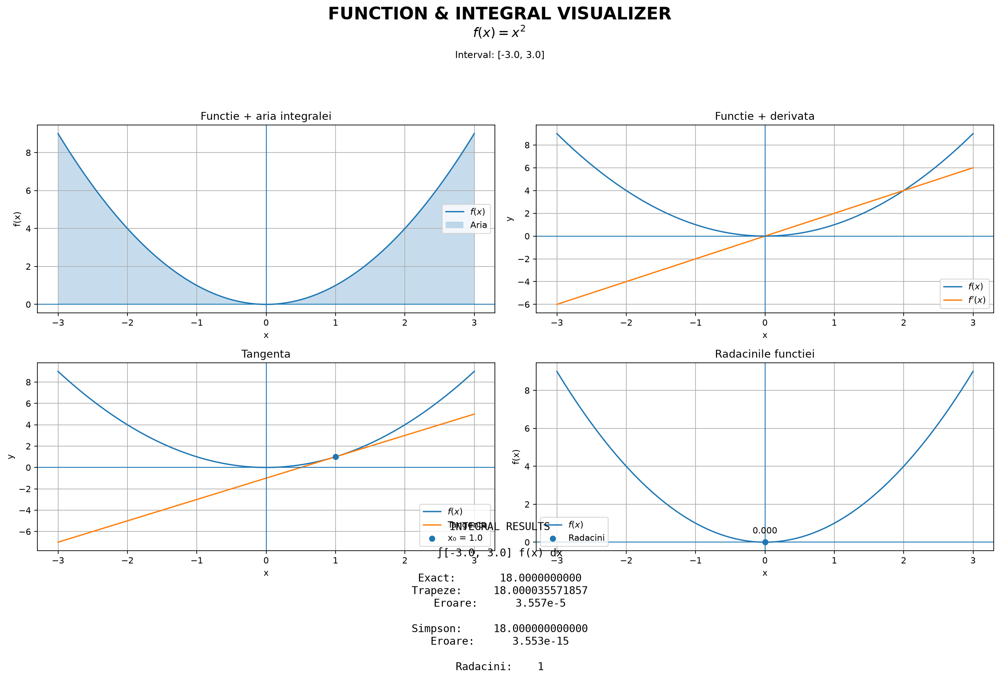
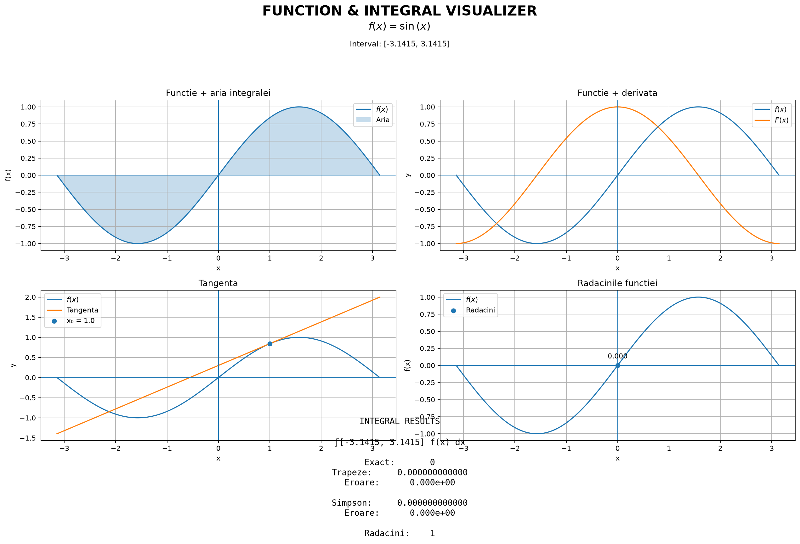

# pyCalculator

- Python application for **symbolic integration, numerical integration, derivatives, roots, tangent lines and visualization**.

# Input

- Function `f(x)`
- Interval `[a, b]`
- Point `x₀`

# Output

- Mathematical properties
- Dashboard

---

## Demo

### 1. `f(x) = x²`

Input:
    f(x) = x²
    [a, b] = [-3, 3]
    x₀ = 1

For this function:

$$
\int_{-3}^{3}x^2\ dx=18
$$

Derivative:

$$
f'(x)=2x
$$

Tangent at `x₀ = 1`:

$$
y=2x-1
$$

---

### 2. `f(x) = sin(x)`

Input:

    f(x) = sin(x)
    [a,b] = [-π,π]
    x₀ = 1

Derivative:

$$
f'(x)=\cos(x)
$$

Roots:

$$
x=-\pi,\quad 0,\quad \pi
$$

---

# Mathematical Theory

## 1. Definite Integral

The exact definite integral is:

$$
\int_a^b f(x)\,dx=F(b)-F(a)
$$

where `F(x)` is an antiderivative of `f(x)`.

The project calculates the exact integral symbolically using **SymPy**.

---

## 2. Trapezoidal Rule

The interval `[a,b]` is divided into `n` subintervals.

$$
h=\frac{b-a}{n}
$$

The approximation is:

$$
T_n=
h\left[
\frac{f(x_0)+f(x_n)}{2}
+
\sum_{i=1}^{n-1}f(x_i)
\right]
$$

---

## 3. Simpson's Rule

For an even `n`:

$$
S_n=
\frac{h}{3}
\left[
f(x_0)+f(x_n)
+4\sum f(x_{odd})
+2\sum f(x_{even})
\right]
$$

The coefficients follow the pattern:

    1  4  2  4  2  ...  4  1

---

## 4. Numerical Error

The absolute error is:

$$
E=
|I_{exact}-I_{approx}|
$$

The project calculates the error for both the Trapezoidal Rule and Simpson's Rule.

---

## 5. Derivative

The derivative is calculated symbolically using:

    sp.diff(function, x)

Mathematically:

$$
f'(x)=\frac{df}{dx}
$$

---

## 6. Tangent Line

For a point `x₀`, the tangent is:

$$
y=f(x_0)+f'(x_0)(x-x_0)
$$

The dashboard displays both the function and its tangent.

---

## 7. Roots

A root satisfies:

$$
f(x)=0
$$

The project finds roots using:

    sp.solve(function, x)

Only roots inside `[a,b]` are displayed.

---

# Python Implementation

The project uses three main Python libraries:

| Library | Purpose |
|---|---|
| **SymPy** | Symbolic mathematics |
| **NumPy** | Numerical calculations |
| **Matplotlib** | Visualization |

---

### Modules

| File | Purpose |
|---|---|
| `main.py` | User input and program flow |
| `function_parser.py` | Function parsing and validation |
| `integrator.py` | Exact and numerical integration |
| `plotter.py` | Graphs and dashboard |
| `requirements.txt` | Project dependencies |

